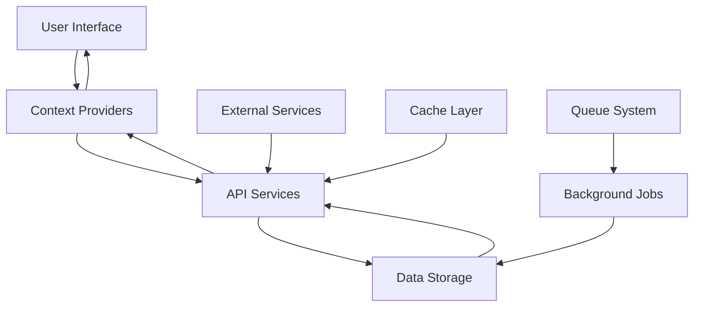

# ECG OMS Technical Documentation

## Table of Contents
1. [System Architecture](#system-architecture)
2. [Data Models](#data-models)
3. [API Documentation](#api-documentation)
4. [Security Implementation](#security-implementation)
5. [Performance Optimization](#performance-optimization)
6. [Deployment Guide](#deployment-guide)
7. [Development Guidelines](#development-guidelines)
8. [Testing Strategy](#testing-strategy)
9. [Monitoring & Logging](#monitoring--logging)
10. [Integration Guide](#integration-guide)

## System Architecture

### Frontend Architecture
```typescript
// Core Technologies
- React 18.x
- TypeScript 4.x
- Tailwind CSS 3.x
- Shadcn UI Components
- Vite 4.x (Build Tool)
- React Query (Data Fetching)
- React Router 6.x (Routing)
- Zustand (State Management)

// Component Structure
interface ComponentArchitecture {
  layout: {
    MainLayout: React.FC;
    AuthLayout: React.FC;
    DashboardLayout: React.FC;
  };
  features: {
    faults: {
      OP5Form: React.FC;
      ControlOutageForm: React.FC;
      FaultList: React.FC;
      FaultDetails: React.FC;
    };
    analytics: {
      Dashboard: React.FC;
      Reports: React.FC;
      Charts: React.FC;
    };
    admin: {
      UserManagement: React.FC;
      SystemConfig: React.FC;
      AuditLogs: React.FC;
    };
  };
  shared: {
    components: {
      Button: React.FC;
      Input: React.FC;
      Select: React.FC;
      Table: React.FC;
      Modal: React.FC;
    };
    hooks: {
      useAuth: () => AuthContext;
      useFaults: () => FaultContext;
      useAnalytics: () => AnalyticsContext;
    };
    utils: {
      api: APIClient;
      validation: ValidationUtils;
      formatting: FormatUtils;
    };
  };
}

// State Management
interface StateManagement {
  global: {
    auth: AuthState;
    theme: ThemeState;
    notifications: NotificationState;
  };
  features: {
    faults: FaultState;
    analytics: AnalyticsState;
    admin: AdminState;
  };
  persistence: {
    local: LocalStorage;
    session: SessionStorage;
    cache: CacheManager;
  };
}
```

### Backend Architecture
```typescript
// Core Technologies
- Node.js 18.x
- Express.js 4.x
- TypeScript 4.x
- PostgreSQL 14.x
- Redis 6.x
- Docker 20.x

// Service Architecture
interface ServiceArchitecture {
  api: {
    routes: RouteManager;
    middleware: MiddlewareManager;
    controllers: ControllerManager;
  };
  services: {
    auth: AuthService;
    faults: FaultService;
    analytics: AnalyticsService;
    notifications: NotificationService;
  };
  database: {
    models: ModelManager;
    migrations: MigrationManager;
    seeds: SeedManager;
  };
  cache: {
    redis: RedisClient;
    memory: MemoryCache;
  };
  queue: {
    tasks: TaskQueue;
    events: EventQueue;
  };
}

// Database Schema
interface DatabaseSchema {
  users: {
    id: UUID;
    username: string;
    email: string;
    password: string;
    role: UserRole;
    regionId?: UUID;
    districtId?: UUID;
    createdAt: DateTime;
    updatedAt: DateTime;
  };
  faults: {
    id: UUID;
    type: FaultType;
    status: FaultStatus;
    regionId: UUID;
    districtId: UUID;
    location: Geography;
    details: JSONB;
    createdAt: DateTime;
    updatedAt: DateTime;
  };
  analytics: {
    id: UUID;
    type: AnalyticsType;
    data: JSONB;
    timestamp: DateTime;
  };
}
```

### Data Flow


## Data Models

### User Model
```typescript
interface User {
  id: string;
  username: string;
  email: string;
  role: 'admin' | 'regional_manager' | 'district_engineer' | 'viewer';
  regionId?: string;
  districtId?: string;
  createdAt: Date;
  updatedAt: Date;
  lastLogin?: Date;
  status: 'active' | 'inactive' | 'suspended';
  preferences: {
    theme: 'light' | 'dark' | 'system';
    notifications: boolean;
    language: string;
  };
  security: {
    twoFactorEnabled: boolean;
    lastPasswordChange: Date;
    failedLoginAttempts: number;
  };
}

interface UserSession {
  id: string;
  userId: string;
  token: string;
  refreshToken: string;
  expiresAt: Date;
  deviceInfo: {
    userAgent: string;
    ipAddress: string;
    location?: string;
  };
  createdAt: Date;
  lastActivity: Date;
}
```

### Fault Models
```typescript
interface OP5Fault {
  id: string;
  regionId: string;
  districtId: string;
  faultLocation: string;
  faultType: string;
  specificFaultType: string;
  occurrenceDate: Date;
  restorationDate?: Date;
  repairDate?: Date;
  mttr?: number;
  status: 'active' | 'resolved';
  priority: 'low' | 'medium' | 'high' | 'critical';
  severity: 'minor' | 'moderate' | 'major' | 'severe';
  affectedPopulation: {
    rural: number;
    urban: number;
    metro: number;
  };
  reliabilityIndices: {
    saidi: number;
    saifi: number;
    caidi: number;
  };
  equipment: {
    type: string;
    model: string;
    serialNumber: string;
    lastMaintenance: Date;
  };
  weather: {
    condition: string;
    temperature: number;
    humidity: number;
    windSpeed: number;
  };
  notes: {
    text: string;
    author: string;
    timestamp: Date;
  }[];
  attachments: {
    id: string;
    type: string;
    url: string;
    uploadedAt: Date;
  }[];
}

interface ControlSystemOutage {
  id: string;
  regionId: string;
  districtId: string;
  outageType: string;
  specificOutageType: string;
  occurrenceDate: Date;
  restorationDate?: Date;
  customersAffected: number;
  duration: number;
  status: 'active' | 'resolved';
  priority: 'low' | 'medium' | 'high' | 'critical';
  impact: {
    systems: string[];
    services: string[];
    customers: {
      residential: number;
      commercial: number;
      industrial: number;
    };
  };
  cause: {
    primary: string;
    secondary?: string;
    details: string;
  };
  response: {
    team: string;
    actions: string[];
    timeline: {
      event: string;
      timestamp: Date;
    }[];
  };
  resolution: {
    method: string;
    steps: string[];
    verification: string;
  };
}
```

## API Documentation

### Authentication
```typescript
// Login
POST /api/auth/login
Request: { 
  username: string, 
  password: string,
  deviceInfo?: {
    userAgent: string;
    ipAddress: string;
  }
}
Response: { 
  token: string, 
  refreshToken: string,
  user: User,
  expiresIn: number
}

// Logout
POST /api/auth/logout
Request: { 
  token: string,
  allDevices?: boolean 
}
Response: { 
  success: boolean,
  message: string
}

// Refresh Token
POST /api/auth/refresh
Request: { 
  refreshToken: string 
}
Response: { 
  token: string,
  refreshToken: string,
  expiresIn: number
}
```

### Fault Management
```typescript
// Create Fault
POST /api/faults
Request: OP5Fault | ControlSystemOutage
Response: { 
  success: boolean, 
  fault: Fault,
  message: string
}

// Update Fault
PUT /api/faults/:id
Request: Partial<OP5Fault> | Partial<ControlSystemOutage>
Response: { 
  success: boolean, 
  fault: Fault,
  message: string
}

// Get Faults
GET /api/faults
Query: {
  regionId?: string;
  districtId?: string;
  status?: string;
  startDate?: string;
  endDate?: string;
  type?: 'op5' | 'control';
  priority?: string;
  severity?: string;
  page?: number;
  limit?: number;
  sortBy?: string;
  sortOrder?: 'asc' | 'desc';
}
Response: {
  faults: Fault[];
  total: number;
  page: number;
  limit: number;
  pages: number;
}
```

## Security Implementation

### Authentication & Authorization
```typescript
// JWT-based Authentication
interface JWTConfig {
  secret: string;
  expiresIn: string;
  refreshTokenExpiresIn: string;
  algorithm: 'HS256' | 'RS256';
  issuer: string;
  audience: string;
}

// Role-based Access Control (RBAC)
interface Permission {
  resource: string;
  action: 'create' | 'read' | 'update' | 'delete';
  conditions?: {
    field: string;
    operator: 'eq' | 'neq' | 'gt' | 'lt' | 'in' | 'nin';
    value: any;
  }[];
}

const rolePermissions = {
  admin: {
    permissions: ['*'],
    description: 'Full system access',
    restrictions: []
  },
  regional_manager: {
    permissions: [
      { 
        resource: 'faults', 
        action: ['create', 'read', 'update'],
        conditions: [
          { field: 'regionId', operator: 'eq', value: '${user.regionId}' }
        ]
      },
      { 
        resource: 'reports', 
        action: ['read'],
        conditions: [
          { field: 'regionId', operator: 'eq', value: '${user.regionId}' }
        ]
      },
      { 
        resource: 'users', 
        action: ['read'],
        conditions: [
          { field: 'regionId', operator: 'eq', value: '${user.regionId}' }
        ]
      }
    ],
    description: 'Regional management access',
    restrictions: ['Cannot modify system settings']
  },
  district_engineer: {
    permissions: [
      { 
        resource: 'faults', 
        action: ['create', 'read'],
        conditions: [
          { field: 'districtId', operator: 'eq', value: '${user.districtId}' }
        ]
      },
      { 
        resource: 'reports', 
        action: ['read'],
        conditions: [
          { field: 'districtId', operator: 'eq', value: '${user.districtId}' }
        ]
      }
    ],
    description: 'District-level access',
    restrictions: ['Cannot access regional data']
  },
  viewer: {
    permissions: [
      { 
        resource: 'faults', 
        action: ['read'],
        conditions: []
      },
      { 
        resource: 'reports', 
        action: ['read'],
        conditions: []
      }
    ],
    description: 'Read-only access',
    restrictions: ['Cannot modify any data']
  }
};
```

### Security Features

#### 1. Authentication
- JWT (JSON Web Token) based authentication
- Refresh token mechanism
- Password hashing using bcrypt
- Session management with secure cookies
- Multi-factor authentication support
- Rate limiting for login attempts
- Account lockout after failed attempts
- Device fingerprinting
- IP-based restrictions
- Session timeout and auto-logout

#### 2. Data Protection
- Input validation and sanitization
- XSS (Cross-Site Scripting) prevention
- CSRF (Cross-Site Request Forgery) protection
- SQL injection prevention
- Data encryption at rest and in transit
- Secure password storage
- Regular security audits
- Data masking for sensitive information
- Secure file upload handling
- Content Security Policy (CSP)

#### 3. API Security
```typescript
// API Security Middleware
interface SecurityMiddleware {
  rateLimit: {
    windowMs: number;
    max: number;
    message: string;
    statusCode: number;
  };
  cors: {
    origin: string[];
    methods: string[];
    credentials: boolean;
    maxAge: number;
    exposedHeaders: string[];
  };
  helmet: {
    contentSecurityPolicy: boolean;
    crossOriginEmbedderPolicy: boolean;
    crossOriginOpenerPolicy: boolean;
    crossOriginResourcePolicy: boolean;
    dnsPrefetchControl: boolean;
    frameguard: boolean;
    hidePoweredBy: boolean;
    hsts: boolean;
    ieNoOpen: boolean;
    noSniff: boolean;
    originAgentCluster: boolean;
    permittedCrossDomainPolicies: boolean;
    referrerPolicy: boolean;
    xssFilter: boolean;
  };
  compression: {
    level: number;
    threshold: number;
  };
  bodyParser: {
    limit: string;
    extended: boolean;
  };
}
```

#### 4. Network Security
- HTTPS/TLS encryption
- Secure headers configuration
- CORS policy implementation
- Rate limiting
- IP whitelisting
- DDoS protection
- Network monitoring
- Load balancing
- Firewall rules
- VPN access for remote workers

#### 5. Audit Logging
```typescript
interface AuditLog {
  id: string;
  userId: string;
  action: string;
  resource: string;
  resourceId: string;
  timestamp: Date;
  ipAddress: string;
  userAgent: string;
  status: 'success' | 'failure';
  details: Record<string, any>;
  metadata: {
    browser: string;
    os: string;
    device: string;
    location?: string;
  };
  changes?: {
    field: string;
    oldValue: any;
    newValue: any;
  }[];
}
```

#### 6. Security Headers
```typescript
const securityHeaders = {
  'Content-Security-Policy': "default-src 'self'",
  'X-Frame-Options': 'DENY',
  'X-Content-Type-Options': 'nosniff',
  'Referrer-Policy': 'strict-origin-when-cross-origin',
  'Permissions-Policy': 'camera=(), microphone=(), geolocation=()',
  'Strict-Transport-Security': 'max-age=31536000; includeSubDomains',
  'X-XSS-Protection': '1; mode=block',
  'X-DNS-Prefetch-Control': 'off',
  'Expect-CT': 'max-age=86400, enforce',
  'Feature-Policy': "geolocation 'none'; microphone 'none'; camera 'none'"
};
```

#### 7. Password Policy
```typescript
interface PasswordPolicy {
  minLength: number;
  requireUppercase: boolean;
  requireLowercase: boolean;
  requireNumbers: boolean;
  requireSpecialChars: boolean;
  preventCommonPasswords: boolean;
  preventPasswordReuse: number;
  maxAge: number;
  complexity: {
    minUppercase: number;
    minLowercase: number;
    minNumbers: number;
    minSpecialChars: number;
  };
  validation: {
    checkCommonPasswords: boolean;
    checkPasswordHistory: boolean;
    checkPasswordAge: boolean;
  };
}
```

#### 8. Security Monitoring
- Real-time security monitoring
- Automated threat detection
- Security incident response
- Regular vulnerability scanning
- Penetration testing
- Security metrics tracking
- Log analysis
- Anomaly detection
- Security alerts
- Compliance monitoring

#### 9. Data Privacy
- GDPR compliance
- Data retention policies
- Data anonymization
- Privacy impact assessments
- User consent management
- Data access controls
- Data classification
- Privacy by design
- Data subject rights
- Privacy policy enforcement

#### 10. Backup & Recovery
- Automated backups
- Encrypted backup storage
- Disaster recovery plan
- Business continuity procedures
- Regular backup testing
- Secure backup access
- Backup verification
- Recovery testing
- Backup retention policy
- Offsite backup storage

### Security Best Practices

1. **Code Security**
   - Regular dependency updates
   - Code security scanning
   - Secure coding guidelines
   - Code review process
   - Automated security testing
   - Static code analysis
   - Dynamic application security testing
   - Dependency vulnerability scanning
   - Security-focused code reviews
   - Secure coding training

2. **Infrastructure Security**
   - Secure server configuration
   - Network segmentation
   - Firewall rules
   - Intrusion detection
   - Regular security patching
   - Access control lists
   - Network monitoring
   - Security groups
   - VPN configuration
   - Load balancer security

3. **User Security**
   - Security awareness training
   - Password management
   - Access control reviews
   - User activity monitoring
   - Security incident reporting
   - Phishing awareness
   - Social engineering prevention
   - Device security
   - Remote access security
   - User authentication

4. **Compliance**
   - Regular security audits
   - Compliance monitoring
   - Security policy enforcement
   - Documentation maintenance
   - Incident response procedures
   - Regulatory compliance
   - Industry standards
   - Security certifications
   - Compliance reporting
   - Policy updates

## Performance Optimization

### Frontend Optimization
- Code splitting
- Lazy loading
- Memoization
- Virtual scrolling
- Image optimization
- Bundle size reduction
- Caching strategies
- Service workers
- Progressive web app
- Performance monitoring

### Data Handling
- Pagination
- Caching
- Debouncing
- Throttling
- Data compression
- Query optimization
- Connection pooling
- Batch processing
- Data prefetching
- Background sync

### Best Practices
1. Use React.memo for pure components
2. Implement useCallback for event handlers
3. Use useMemo for expensive calculations
4. Implement proper error boundaries
5. Optimize render cycles
6. Minimize re-renders
7. Use proper key props
8. Implement code splitting
9. Optimize bundle size
10. Use performance monitoring

## Deployment Guide

### Prerequisites
- Node.js 16.x or higher
- npm 7.x or higher
- Modern web browser
- Git
- Docker
- PostgreSQL
- Redis
- Nginx

### Build Process
```bash
# Install dependencies
npm install

# Build for production
npm run build

# Start production server
npm run start

# Run tests
npm run test

# Lint code
npm run lint

# Type check
npm run type-check
```

### Environment Variables
```env
# Application
VITE_API_URL=https://api.ecg-oms.com
VITE_APP_NAME=ECG OMS
VITE_ENV=production

# Database
DB_HOST=localhost
DB_PORT=5432
DB_NAME=ecg_oms
DB_USER=postgres
DB_PASSWORD=secure_password

# Redis
REDIS_HOST=localhost
REDIS_PORT=6379
REDIS_PASSWORD=secure_password

# JWT
JWT_SECRET=your_jwt_secret
JWT_EXPIRES_IN=1d
JWT_REFRESH_EXPIRES_IN=7d

# Email
SMTP_HOST=smtp.example.com
SMTP_PORT=587
SMTP_USER=user@example.com
SMTP_PASSWORD=secure_password

# Storage
STORAGE_TYPE=s3
AWS_ACCESS_KEY_ID=your_access_key
AWS_SECRET_ACCESS_KEY=your_secret_key
AWS_BUCKET_NAME=your_bucket
AWS_REGION=your_region
```

### Deployment Checklist
1. [ ] Run tests
2. [ ] Build application
3. [ ] Configure environment
4. [ ] Deploy to server
5. [ ] Verify deployment
6. [ ] Monitor performance
7. [ ] Check security
8. [ ] Verify backups
9. [ ] Test recovery
10. [ ] Update documentation

## Maintenance

### Regular Tasks
1. Update dependencies
2. Backup data
3. Monitor performance
4. Review logs
5. Apply security patches
6. Check system health
7. Optimize database
8. Clean up storage
9. Update documentation
10. Review security

### Troubleshooting
1. Check error logs
2. Verify database connection
3. Test API endpoints
4. Monitor system resources
5. Review user reports
6. Check network connectivity
7. Verify security settings
8. Test backup recovery
9. Check system updates
10. Review performance metrics

## Penetration Testing Guide

### 1. Authentication Testing

#### 1.1 Firebase Authentication Tests
```typescript
// Test Cases for Authentication
const authTestCases = {
  // Brute Force Protection
  bruteForceTest: async () => {
    const attempts = 10;
    const results = [];
    for (let i = 0; i < attempts; i++) {
      try {
        await signInWithEmailAndPassword(auth, 'test@example.com', 'wrong_password');
      } catch (error) {
        results.push(error.code);
      }
    }
    return results;
  },

  // Session Management
  sessionTest: async () => {
    const sessionChecks = {
      tokenExpiration: false,
      refreshTokenRotation: false,
      concurrentSessions: false
    };
    // Test token expiration
    const token = await auth.currentUser?.getIdToken();
    sessionChecks.tokenExpiration = token ? true : false;
    return sessionChecks;
  },

  // Password Policy
  passwordPolicyTest: async () => {
    const testPasswords = [
      'weak',
      'password123',
      'P@ssw0rd',
      'ComplexP@ssw0rd123!'
    ];
    return testPasswords.map(pwd => ({
      password: pwd,
      meetsPolicy: /^(?=.*[a-z])(?=.*[A-Z])(?=.*\d)(?=.*[@$!%*?&])[A-Za-z\d@$!%*?&]{8,}$/.test(pwd)
    }));
  }
};
```

#### 1.2 Security Headers Testing
```typescript
// Test Security Headers
const securityHeadersTest = async () => {
  const requiredHeaders = {
    'Content-Security-Policy': "default-src 'self'",
    'X-Frame-Options': 'DENY',
    'X-Content-Type-Options': 'nosniff',
    'Strict-Transport-Security': 'max-age=31536000; includeSubDomains',
    'X-XSS-Protection': '1; mode=block'
  };
  
  const response = await fetch('/api/health');
  const headers = response.headers;
  
  return Object.entries(requiredHeaders).map(([header, value]) => ({
    header,
    required: value,
    present: headers.get(header) === value
  }));
};
```

### 2. Firestore Security Testing

#### 2.1 Data Access Tests
```typescript
// Test Firestore Security Rules
const firestoreSecurityTest = async () => {
  const testCases = {
    // Unauthorized Access
    unauthorizedAccess: async () => {
      try {
        await getDocs(collection(db, 'faults'));
        return { success: false, message: 'Security rules failed' };
      } catch (error) {
        return { success: true, message: 'Security rules working' };
      }
    },

    // Cross-Region Access
    crossRegionAccess: async () => {
      const testFault = {
        regionId: 'region_1',
        districtId: 'district_1'
      };
      try {
        await addDoc(collection(db, 'faults'), testFault);
        return { success: false, message: 'Cross-region access allowed' };
      } catch (error) {
        return { success: true, message: 'Cross-region access blocked' };
      }
    },

    // Role-Based Access
    roleBasedAccess: async () => {
      const roles = ['viewer', 'district_engineer', 'regional_manager', 'admin'];
      const results = {};
      
      for (const role of roles) {
        try {
          await updateDoc(doc(db, 'faults', 'test_fault'), { status: 'resolved' });
          results[role] = { success: false, message: 'Unauthorized access allowed' };
        } catch (error) {
          results[role] = { success: true, message: 'Access properly restricted' };
        }
      }
      
      return results;
    }
  };
  
  return testCases;
};
```

### 3. Storage Security Testing

#### 3.1 File Upload Tests
```typescript
// Test Storage Security Rules
const storageSecurityTest = async () => {
  const testCases = {
    // File Type Validation
    fileTypeTest: async () => {
      const testFiles = [
        { name: 'test.exe', type: 'application/x-msdownload' },
        { name: 'test.jpg', type: 'image/jpeg' },
        { name: 'test.pdf', type: 'application/pdf' }
      ];
      
      const results = [];
      for (const file of testFiles) {
        try {
          await uploadFile(file, 'faults/test_fault');
          results.push({ file: file.name, allowed: true });
        } catch (error) {
          results.push({ file: file.name, allowed: false });
        }
      }
      return results;
    },

    // File Size Validation
    fileSizeTest: async () => {
      const testSizes = [4 * 1024 * 1024, 5 * 1024 * 1024, 6 * 1024 * 1024];
      const results = [];
      
      for (const size of testSizes) {
        const file = new Blob(['x'.repeat(size)]);
        try {
          await uploadFile(file, 'faults/test_fault');
          results.push({ size, allowed: true });
        } catch (error) {
          results.push({ size, allowed: false });
        }
      }
      return results;
    }
  };
  
  return testCases;
};
```

### 4. API Endpoint Testing

#### 4.1 Endpoint Security Tests
```typescript
// Test API Endpoints
const apiSecurityTest = async () => {
  const testCases = {
    // Rate Limiting
    rateLimitTest: async () => {
      const requests = 100;
      const results = [];
      
      for (let i = 0; i < requests; i++) {
        try {
          await fetch('/api/faults');
          results.push({ request: i + 1, success: true });
        } catch (error) {
          results.push({ request: i + 1, success: false });
        }
      }
      return results;
    },

    // Input Validation
    inputValidationTest: async () => {
      const testInputs = [
        { name: 'SQL Injection', value: "' OR '1'='1" },
        { name: 'XSS Attack', value: '<script>alert("xss")</script>' },
        { name: 'Path Traversal', value: '../../../etc/passwd' }
      ];
      
      const results = [];
      for (const input of testInputs) {
        try {
          await fetch('/api/faults', {
            method: 'POST',
            body: JSON.stringify({ description: input.value })
          });
          results.push({ input: input.name, blocked: false });
        } catch (error) {
          results.push({ input: input.name, blocked: true });
        }
      }
      return results;
    }
  };
  
  return testCases;
};
```

### 5. Penetration Testing Checklist

#### 5.1 Authentication & Authorization
- [ ] Test brute force protection
- [ ] Verify session management
- [ ] Check password policy enforcement
- [ ] Test multi-factor authentication
- [ ] Verify role-based access control
- [ ] Test token expiration and rotation
- [ ] Check concurrent session handling
- [ ] Verify secure password reset flow

#### 5.2 Data Security
- [ ] Test Firestore security rules
- [ ] Verify data encryption
- [ ] Check cross-region access controls
- [ ] Test data validation
- [ ] Verify audit logging
- [ ] Check backup security
- [ ] Test data deletion
- [ ] Verify data retention policies

#### 5.3 Storage Security
- [ ] Test file upload restrictions
- [ ] Verify file type validation
- [ ] Check file size limits
- [ ] Test storage access controls
- [ ] Verify file deletion
- [ ] Check storage encryption
- [ ] Test file sharing permissions
- [ ] Verify storage audit logs

#### 5.4 API Security
- [ ] Test rate limiting
- [ ] Verify input validation
- [ ] Check CORS configuration
- [ ] Test API authentication
- [ ] Verify error handling
- [ ] Check request validation
- [ ] Test API versioning
- [ ] Verify API documentation

#### 5.5 Network Security
- [ ] Test SSL/TLS configuration
- [ ] Verify security headers
- [ ] Check DNS configuration
- [ ] Test firewall rules
- [ ] Verify network encryption
- [ ] Check load balancer security
- [ ] Test DDoS protection
- [ ] Verify VPN access

### 6. Security Monitoring

#### 6.1 Monitoring Setup
```typescript
// Security Monitoring Configuration
const securityMonitoring = {
  // Log Monitoring
  logMonitoring: {
    enabled: true,
    logTypes: ['auth', 'firestore', 'storage', 'api'],
    retentionPeriod: '30d',
    alertThresholds: {
      failedLogins: 5,
      unauthorizedAccess: 1,
      dataBreach: 1
    }
  },

  // Performance Monitoring
  performanceMonitoring: {
    enabled: true,
    metrics: ['responseTime', 'errorRate', 'requestVolume'],
    thresholds: {
      maxResponseTime: 1000,
      maxErrorRate: 0.01,
      maxRequestVolume: 1000
    }
  },

  // Security Alerts
  securityAlerts: {
    enabled: true,
    channels: ['email', 'slack', 'sms'],
    severityLevels: ['low', 'medium', 'high', 'critical'],
    notificationRules: {
      critical: ['email', 'slack', 'sms'],
      high: ['email', 'slack'],
      medium: ['email'],
      low: ['slack']
    }
  }
};
```

### 7. Remediation Procedures

#### 7.1 Security Incident Response
```typescript
// Security Incident Response Plan
const securityIncidentResponse = {
  // Incident Classification
  incidentTypes: {
    dataBreach: {
      severity: 'critical',
      responseTime: '1h',
      team: 'security',
      procedures: [
        'Isolate affected systems',
        'Preserve evidence',
        'Notify stakeholders',
        'Begin investigation',
        'Implement remediation'
      ]
    },
    unauthorizedAccess: {
      severity: 'high',
      responseTime: '2h',
      team: 'security',
      procedures: [
        'Block access',
        'Review logs',
        'Update security rules',
        'Notify affected users'
      ]
    },
    serviceDisruption: {
      severity: 'medium',
      responseTime: '4h',
      team: 'operations',
      procedures: [
        'Assess impact',
        'Implement workaround',
        'Restore service',
        'Update documentation'
      ]
    }
  },

  // Communication Plan
  communicationPlan: {
    stakeholders: [
      'Security Team',
      'Development Team',
      'Operations Team',
      'Management',
      'Users'
    ],
    channels: [
      'Email',
      'Slack',
      'Phone',
      'SMS'
    ],
    templates: {
      initialNotification: 'template_initial_notification',
      statusUpdate: 'template_status_update',
      resolution: 'template_resolution'
    }
  }
};
```

### 8. Regular Security Testing Schedule

#### 8.1 Testing Frequency
- Daily: Automated security scans
- Weekly: Manual security reviews
- Monthly: Penetration testing
- Quarterly: Comprehensive security audit
- Annually: Full security assessment

#### 8.2 Testing Scope
- Authentication systems
- Data access controls
- API endpoints
- Storage security
- Network security
- Application security
- Infrastructure security
- Compliance requirements

#### 8.3 Reporting Requirements
- Executive summary
- Technical details
- Risk assessment
- Remediation steps
- Timeline for fixes
- Follow-up actions
- Lessons learned
- Recommendations 